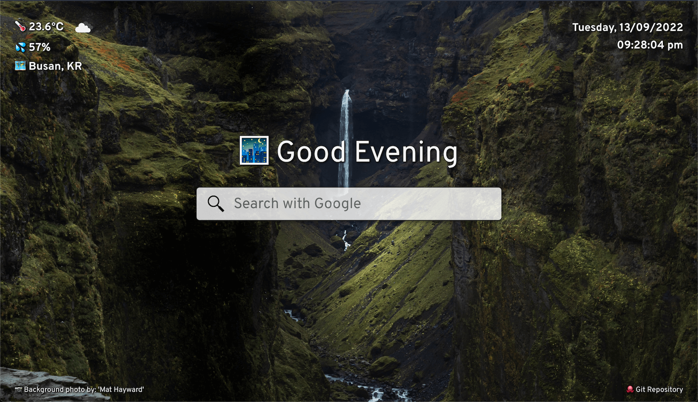

# Start Page Dashboard Project

Live Demo: https://ts-oh.github.io/dashboard/

## Screenshots

## Description 

A start page like Moment extension for chrome based browsers. The start page contains minimalist time, weather, and google search bar display. The start page also fetches random background image from Unsplash API hosted through Scrimba.

## Lessons/Comments

This project involved learning how to fetch data from an API. But it also involved incorporating multiple lessons from other projects. Some of the concepts that were included were the use of factory functions to return variables and methods as an object and using modules to separate parts into components. 

Furthermore, the DOM elements were created through the use of JavaScript. Overall learning about asynchronous function to fetch data from API was fascinating. Also separating different parts of the app through modules and creating each part through factory function was very enjoyable as it made the code organised and easier to debug. 